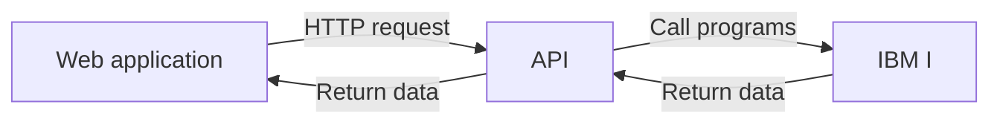

# How to modernize an IBM I program as a web application

## The REST API
To retrieve the data and logic of the IBM I application to the web application, we will need to create a REST API written in RPG and will use the existing programs and data.

### What is a REST API ?
A REST API is an application programming interface (API) that uses HTTP requests to GET, PUT, POST and DELETE data. It is an architecture style for designing networked applications.



IBM provide us a tool to create a REST API, through Web Services (WS).

## How to code a web service
### The data-structures copybook
The first step will be to create a data-structures copybook. This copybook will contain all the data-structures of all the tables used by the API.

**Example of the data-structure of an article**
```RPGLE
Dcl-DS Article_T TEMPLATE QUALIFIED;
  ID                Char(6);
  DESCRIPTION       Char(50);
  SALE_PRICE        Zoned(7:2);
  WHOLESALE_PRICE   Zoned(7:2);
  ARTICLE_ID        Char(3);
  STOCK             Zoned(5:0);
  MINIMUM_QUANTITY  Zoned(5:0);
  CUSTOMER_QUANTITY Zoned(5:0);
  PURCHASE_QUANTITY Zoned(5:0);
  VAT_ID            Char(1);
  CREATION_DATE     Date;
  LAST_MODIFICATION Timestamp;
  LAST_MODIFIER_ID  Char(10);
  DELETED           Char(1);
End-DS;
```
You probably noticed that the fields of the Decimal type changed to Zoned type. This is because the Decimal type is not supported in RPGLE. The Zoned type is the RPGLE equivalent of the Decimal type.

We recommend to name the data-structure fields as a simple name, without the table name. It will be easier to use them in the procedures and in the web application.

### The procedures prototypes
The second step will be to create the prototypes of the procedures.
To understand what parameters will be needed,
 
#### **What are HTTP requests ?**

HTTP Requests are the basis of the web. When you type an URL in your browser, you are sending a GET request to the server and the server is sending you back the HTML code of the page you requested.

An HTTP request is composed of 3 parts:
- The URL
- The headers
- The body

**The URL** is the address of the API. It is composed of the IP address of the IBM I, the port of the HTTP server and the name of the API. The URL is always the same for a specific API.

**The headers** are used to send some information to the API. For example, the headers can be used to send the credentials of the user if the application use authentication.

**The body** is used to send some data to the API. For example, the body can be used to send the data of a new article to create. Notice that the body is not used in every HTTP requests.

#### **HTTP Responses**
An HTTP response is composed of 2 parts:
- The headers
- The body

The headers are used to send some information to the web application. For example, the headers can be used to send the status of the request (200, 404, 500, ...).

#### **HTTP Methods**

Here are the HTTP requests methods provided by the Web Services tool :

| Method | Description | CRUD equivalent | Body needed | Status codes used |
| --- | --- | --- | --- | --- |
| POST | Used to create a new element | CREATE | YES | 201, 400, 500 |
| GET | Used to retrieve data | READ | NO | 200, 404, 500 |
| PUT | Used to update data | UPDATE | YES | 200, 400, 404, 500 |
| DELETE | Used to send data to the API | DELETE | NO | 200, 400, 404, 500 |

The list of the status codes is available here : https://en.wikipedia.org/wiki/List_of_HTTP_status_codes.

In general in a REST API, we use two GET requests :
- One to retrieve a list of elements : GetAll
- One to retrieve a specific element : GetByID

But we can create as many GET requests as we want. For example, we can create a GetByDescription request to retrieve an article by its description, or a GetByFamily request to retrieve all the articles of a specific family.

But another way is the use of parameters.

#### Parameters
There is a plenty of parameters that can be used in a request. But the two more used are :
- Path parameters, used to send data in the URL (ex: /articles/1234)
- Query parameters, used to send data in the URL (ex: /articles?description=chair)

Path params are typically used when retrieving a single resource, while query params are used when retrieving multiple resources.

#### **The procedures prototypes**
Now that we know what HTTP requests are, we can create the prototypes of the procedures. We will use one procedure for each HTTP request needed.

Imagine that we have the same article table. And the different features needed are :
- Show all the articles
- Search an article
- Show a particular article 
- Create an article
- Update an article
- Delete an article

We will theorectically need 6 procedures. But we can group some features in the same procedure : Show all and search are the same feature, the difference is that the search procedure will use a query parameter to filter the results. So we will only need 5 procedures:

- Article_Read_All (with a query parameter)
- Article_Read_By_ID
- Article_Create
- Article_Update
- Article_Delete

You can totally use 6 procedures if you want, it is just a matter of preference.

#### **The parameters**
The parameters according to the Web Services tool are the input and output parameters of the procedures. The input parameters are the parameters that will be sent to the procedure by the web application. The output parameters are the parameters that will be sent back to the web application by the procedure.
There are parameters that are really recommended for each procedure : headers and status, respectively input and output.

The procedures can only accept 7 parameters (input and output) maximum. If we count the HTTP status and headers parameters it will get down to 5 usable parameters. So if you need more than 5 parameters, you will need to create a data-structure containing all the parameters or to pass parameters through an array.

We also have to add a seventh parameter `Articles_Nb`, that will store the number of article to show. If we don't use it, if the request for example asks for 500 articles and there is only 300 of it, this will replace the 200 missing articles by empty articles that may lead to bugs. 

Fetching data from the API can take a long time, so we recommend to don't fetch all the data of the table. We can for example add two parameters : page and limit. The page parameter will be used to know which page of the results we want to fetch. The limit parameter will be used to know how many results we want to fetch.

| Procedure | HTTP Method | input  | output | total |
| --- | --- | --- | --- | --- |
| Article_Read_All | GET | headers, search, page, limit | status, Articles | 6
| Article_Read_By_ID | GET | headers, id | status, Article_T | 4
| Article_Create | POST | headers, Article_T | status | 3
| Article_Update | PUT | headers, Article_T | status | 3
| Article_Delete | DELETE | headers, id | status | 3

#### **Time to code the procedures**
Now that we have all the information needed, we can start to code the procedures. You will need to create a `RPGLE` file that we will call WS_ARTICLE

```RPGLE
// Article_Read_All - GET
Dcl-PR Article_Read_All;
  Articles_Nb  Int(10);
  Limit        Int(10);
  Page_Nb      Int(10);
  Search       Char(25);
  Articles     LIKEDS(Article_T) DIM(10000) OPTIONS(*VARSIZE);
  Http_Status  Int(10);
  HttpHeaders  Char(100) DIM(10);
End-PR;
```

After the procedure prototype, we will need to add the procedure itself.

#### **The procedure**
You will need to add the procedure in a new `SQLRPGLE` file that we will also name `WS_ARTICLE`.

Firstly, declare the procedure name :

```
DCL-PROC Article_Read_All EXPORT;
```
  
Then, declare the input parameters. They must be the same as the prototype.
  
```RPGLE
  Dcl-PI Article_Read_All;
    Nb_Articles Int(10);
    Page_Nb     Int(10);
    Search      Char(25);
    Articles    LIKEDS(Article_T) DIM(10000) OPTIONS(*VARSIZE);
    Http_Status Int(10);
    HttpHeaders Char(100) DIM(10);
  End-PI;
  ```

  And also declare the SQL request, and Result, the variable where we are going to store each article before placing it in the Articles output parameter :

  ```RPGLE
  // Local declarations
  Dcl-S  Requete  VarChar(2000);
  Dcl-DS Result   LIKEDS(Article_T);
  ``` 

  And then we can start to write a SQL request that will select the different fields we want  :

  ```RPGLE
  Requete = 'SELECT ARID, ARDESC, ARSALEPR, ARWHSPR, ARTIFA, ARSTOCK,ARMINQTY, ARCUSQTY, '
          + 'ARPURQTY, ARVATCD, ARCREA, ARMOD, ARMODID, ARDEL '
          + 'FROM ARTICLE ';
  ```
  And add the different parameters :
  ```RPGLE
  IF Search <> *BLANKS;
    Requete += 'ORDER BY DIFFERENCE(ARDESC, ' + X'7D' + Search + X'7D' + ') DESC ';
  ELSE;
    Requete += 'ORDER BY ARDESC ';
  ENDIF;
  ```

We are using the `DIFFERENCE` function to order the results by the similarity between the description of the article and the search parameter. The `X'7D'` is used to add the `%LIKE%` operator to the search parameter. If the search term is not filled, we will order by the article description.

```RPGLE
Requete += 'LIMIT ' + %CHAR(Nb_Articles) + ' OFFSET ' + %CHAR((Page_Nb - 1) * Nb_Articles);
```

This add on the request will only select the articles that are at a certain page, for example if the Page_Nb is equal to 5 and Nb_Articles is equal to 100, it will only show the 401 to 500 first result.

Then we can execute the request and fill the array:
```RPGLE
// Prepare and execute the request
EXEC SQL PREPARE P_GetArticles FROM :Requete;
EXEC SQL DECLARE C_GetArticles CURSOR FOR P_GetArticles;
EXEC SQL OPEN C_GetArticles;
EXEC SQL FETCH NEXT FROM C_GetArticles INTO :Result;

// Loop on the articles to fill the array
DOW SqlCode = 0 AND Articles_Nb <= RowCount;
  Articles_Nb += 1;
  Articles(Articles_Nb) = Result;
  EXEC SQL FETCH NEXT FROM C_GetArticles INTO :Result;
ENDDO;

// Close the request 
EXEC SQL CLOSE C_GetArticles;
```